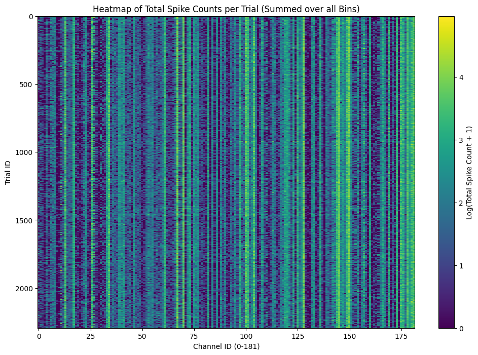

数据来源：[NLB_maze](https://neurallatents.github.io/datasets.html)

数据格式：[Notebook](https://github.com/neurallatents/neurallatents.github.io/blob/master/notebooks/mc_maze.ipynb)

1. 环境搭建

```
uv sync
uv run main.py # 或者在编辑器中手动切换环境
```

2. stardard数据下载

```
dandi download DANDI:000128/0.220113.0400
```


一些数据统计结果

再50ms bin中, spike的分布情况如下:

统计单位: Per Channel Per 50ms Bin
非0样本极值: Max 15 spikes
------------------------------
  0 spikes : 21609728 次 (88.09%)
  1 spikes : 2388861 次 (9.74%)
  2 spikes : 436817 次 (1.78%)
  3 spikes : 78702 次 (0.32%)
  4 spikes : 13679 次 (0.06%)
  5 spikes : 2422 次 (0.01%)
  6 spikes : 370 次 (0.00%)
  7 spikes : 84 次 (0.00%)
  8 spikes : 17 次 (0.00%)
  9 spikes : 6 次 (0.00%)
  11 spikes : 1 次 (0.00%)
  15 spikes : 1 次 (0.00%)

可见静息是常态

统计不同任务，各个通道的放电情况：



可见数据还是比较好的，做不同任务时，基本放电特征一样。


同样位置，神经元放电模式？脉冲神经网络？
